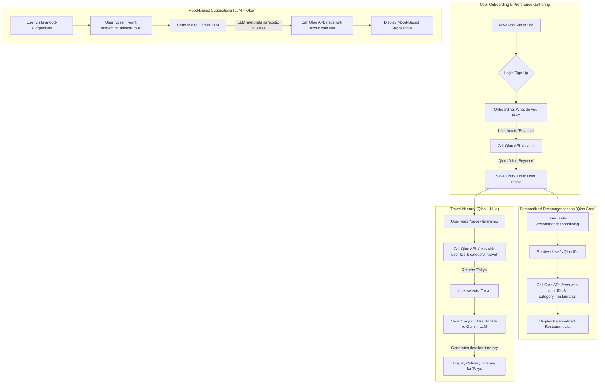

# FlavorJourney: Application Flow, Routes, and Features

This document outlines the core application flow, required routes, and feature breakdown for the FlavorJourney project. It is a living document and will be updated as new insights are gained.

## 1. Application Routes

Based on the project plan, the following routes are necessary. Server-side logic for user-facing pages will be handled by co-located `+page.server.ts` files, which manage data loading and form actions.

### User-Facing Routes (`+page.svelte`)

- **`/`**: Home/Landing Page.
- **`/onboarding`**: For new users to input their cultural preferences.
- **`/recommendations/dining`**: To display personalized local dining recommendations.
- **`/mood-suggestions`**: A chat-like interface for mood-based recommendations.
- **`/travel-itineraries`**: To display travel destination ideas and generate detailed culinary itineraries.
- **`/community`**: For community engagement features like reviews and ratings.
- **`/explore`** (or `/popular`): A fallback/discovery page for popular recommendations.
- **`/pricing`** (or `/subscribe`): To detail the freemium model and subscription tiers.
- **`/login`**: For user authentication.
- **`/profile`** (or `/settings`): For users to manage their profile and preferences.

### Dedicated API Routes (`+server.ts`)

- **`/login/google`**: Initiates the Google OAuth authentication flow.
- **`/login/google/callback`**: Handles the callback from Google's OAuth service.

---

## 2. Feature Breakdown by Route

### `/` (Home/Landing Page)

- **Purpose**: Introduce FlavorJourney, capture user interest, and guide them towards core functionalities.
- **Key Features**: Executive summary/tagline, clear calls to action (e.g., "Start Your Journey Today!"), brief overview of core features (personalized recommendations, mood-based interaction, freemium model), prominent login/sign-up prompts.
- **Potential Enhancements**: Dynamic content showcasing popular recommendations, animated elements, localized content.

### `/onboarding`

- **Purpose**: Collect initial cultural preferences from the user to enable personalized recommendations.
- **Key Features**: Welcome message, interactive input fields for cultural preferences (music, books, films, fashion brands) with search/mapping to Qloo entity IDs, clear explanation of how preferences enhance recommendations, progress indicators for multi-step flows.
- **Potential Enhancements**: Robust user account creation, options to import preferences, gamification.

### `/recommendations/dining`

- **Purpose**: Display tailored restaurant suggestions based on the user's cultural preferences.
- **Key Features**: List/cards of recommended restaurants with name, location, cuisine type, basic filters (dietary, price range for premium users), call to action for each recommendation, loading states, and error handling.
- **Potential Enhancements**: Map integration, advanced filtering, booking integration, user reviews/ratings.

### `/mood-suggestions`

- **Purpose**: Provide dynamic recommendations based on a user's current mood or craving through a conversational interface.
- **Key Features**: Chat interface for text input, display of LLM-generated recommendations, suggestive prompts.
- **Potential Enhancements**: Improved LLM integration for nuanced responses, voice input, ability to refine suggestions within chat.

### `/travel-itineraries`

- **Purpose**: Offer personalized travel destinations and detailed culinary itineraries.
- **Key Features**: Travel destination recommendations based on cultural preferences, LLM-generated culinary itinerary for selected destinations (premium feature), and an option to trigger itinerary generation.
- **Potential Enhancements**: Flight/hotel booking integration, offline access, group planning.

### `/community`

- **Purpose**: Foster user interaction by allowing sharing of experiences, ratings, and reviews.
- **Key Features (MVP)**: Review/rating submission forms, display of user-generated content (reviews, ratings).
- **Potential Enhancements**: Photo sharing, discussion forums, user profiles with activity feeds, user-generated lists.

### `/explore` or `/popular`

- **Purpose**: Provide alternative discovery paths, showcasing curated or popular recommendations.
- **Key Features**: Curated list of popular dining/travel spots, basic categorization/filtering.
- **Potential Enhancements**: Dynamic updates based on trends, "Surprise Me" feature.

### `/pricing` or `/subscribe`

- **Purpose**: Clearly explain subscription tiers and benefits.
- **Key Features**: Tier comparison table (Free, Basic, Premium) with features and pricing, calls to action to subscribe, explanation of "Pay-What-You-Can" options.
- **Potential Enhancements**: Annual subscription discounts, clear upgrade paths.

### `/login`

- **Purpose**: Allow users to sign in or sign up.
- **Key Features**: Login form (username/email, password), sign-up link, "Sign in with Google" button, error message display.
- **Potential Enhancements**: "Forgot Password" flow, support for other OAuth providers.

### `/profile` or `/settings`

- **Purpose**: Allow users to view and modify account details and preferences.
- **Key Features**: Interface to view/edit cultural preferences, display basic account information.
- **Potential Enhancements**: Saved recommendations/itineraries, notification settings, privacy settings, subscription management.

---

## 3. Core Application Flow

### Core Concepts: The Roles of Qloo and Gemini

- **Qloo's Taste AI™ API**: This is the core recommendation engine. Its job is to understand a user's taste based on their stated preferences (e.g., favorite artists, books, movies) and recommend new things (like restaurants or travel destinations) that align with that taste profile. It works with structured data (entity IDs).
- **Google Gemini (LLM)**: This is the natural language and creative engine. Its job is to understand unstructured, conversational human language (like a mood or a craving) and to generate creative, narrative content (like a travel itinerary). It acts as a bridge between the user's abstract feelings and the structured data Qloo needs, or it enriches Qloo's recommendations with descriptive content.

### Application Flow Diagram

### Detailed Explanation of the Flow

#### 1. User Onboarding & Preference Gathering

1.  **Initial Interaction**: A new user arrives at the FlavorJourney landing page and is prompted to sign up or log in.
2.  **Preference Input (`/onboarding`)**: The user is guided through an engaging interface where they can input their favorite things across different categories (music, books, films, etc.).
3.  **Qloo Search API**: For each item the user enters (e.g., the artist "Beyonce"), the backend makes a call to the **Qloo `/search` endpoint**. This endpoint finds the official entity in Qloo's database and returns its unique Qloo ID.
4.  **Profile Building**: These Qloo entity IDs are saved to the user's profile. This collection of IDs forms the user's "taste profile," which is the basis for all future recommendations.

#### 2. Personalized Dining Recommendations Flow

1.  **User Request**: The user navigates to the "Local Dining" page (`/recommendations/dining`).
2.  **Qloo Recommendations API**: The backend retrieves the user's stored Qloo IDs and makes a call to the **Qloo `/recs` endpoint**. This request includes the user's taste profile (the list of IDs) and specifies the desired category of recommendations (e.g., `category: 'restaurants'`).
3.  **Display Results**: Qloo's API returns a list of restaurants whose patrons' tastes correlate with the user's own. The frontend then displays this list.

#### 3. Mood-Based Suggestions Flow (The Gemini + Qloo Synergy)

1.  **User's Mood**: The user goes to the chat interface (`/mood-suggestions`) and types a free-form request, such as "I had a long day, I need some comfort food."
2.  **Gemini's Interpretation**: This text is sent to the **Google Gemini API**. The LLM's task is to interpret the _intent_ behind the user's words. It might identify "comfort food" as a key concept and associate it with categories like "Italian," "American (Traditional)," or "Soup."
3.  **Qloo Recommendation**: The backend takes the concepts identified by Gemini and uses them to query the **Qloo `/recs` endpoint**, further personalizing the query with the user's base cultural preferences.
4.  **Contextual Suggestions**: Qloo returns a list of restaurants that match both the user's underlying taste and the immediate mood-based context provided by Gemini.

#### 4. Travel Itinerary Flow (The Qloo + Gemini Synergy)

1.  **Destination Discovery**: The user requests travel ideas. The backend calls the **Qloo `/recs` endpoint** with the user's taste profile and `category: 'travel'`.
2.  **User Selection**: The user selects a destination (e.g., "Tokyo") from the list of recommendations.
3.  **Gemini's Itinerary Generation**: The application prompts the **Google Gemini API** with a request like: "Create a 3-day culinary itinerary for Tokyo for a person who loves sci-fi books, electronic music, and minimalist design."
4.  **Rich, Personalized Content**: Gemini generates a detailed, narrative-style itinerary, weaving in the user's specific tastes to create a highly personalized and engaging travel plan.
