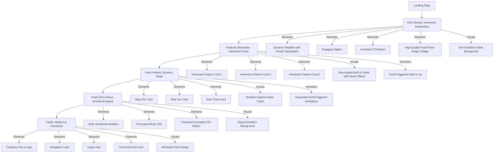

# FlavorJourney Enhanced Landing Page Design Plan

This document outlines a detailed, modern design plan for the FlavorJourney landing page, moving beyond a generic approach to incorporate cutting-edge 2025 web design trends. It focuses on creating an immersive, visually striking, and highly engaging experience while maintaining core brand identity and ensuring performance and accessibility.

## Overall Vision

A dynamic, eye-catching, and emotionally resonant landing page that leverages modern design aesthetics, sophisticated animations, and high-quality imagery to powerfully communicate FlavorJourney's value proposition. The design will create a unique visual identity, encourage deep user engagement, and seamlessly guide visitors towards sign-up, all built with advanced Tailwind CSS techniques.

## Design Plan (JSON Specification)

```json
{
	"project": "FlavorJourney Enhanced Landing Page",
	"overview": "A detailed plan for the FlavorJourney landing page incorporating 2025 web design trends, advanced Tailwind CSS, and a focus on immersive user experience, visual identity, and performance.",
	"sections": [
		{
			"id": "hero-section",
			"name": "Hero Section - Immersive Introduction",
			"description": "The primary section, designed for immediate, high-impact engagement. It combines striking visuals, dynamic typography, and subtle interactions to convey FlavorJourney's essence.",
			"layout": {
				"type": "grid",
				"columns": "lg:grid-cols-2",
				"align": "center",
				"justify": "between",
				"classes": "min-h-screen p-8 relative overflow-hidden bg-gradient-to-br from-purple-50 to-pink-100 dark:from-gray-950 dark:to-purple-950"
			},
			"elements": [
				{
					"type": "div",
					"classes": "relative z-10 text-center lg:text-left max-w-3xl mx-auto lg:mx-0 animate-fade-in-up",
					"children": [
						{
							"component": "h1",
							"text": "FlavorJourney: Your Next Culinary & Travel Saga Begins",
							"classes": "text-6xl lg:text-7xl font-extrabold tracking-tighter leading-tight text-gray-900 dark:text-white mb-6 font-display variable-font-weight"
						},
						{
							"component": "p",
							"text": "Unearth personalized dining and travel experiences, crafted by AI to match your unique tastes, mood, and cultural curiosity. Beyond recommendations, it's a journey.",
							"classes": "text-xl text-gray-700 dark:text-gray-300 mb-10 opacity-0 animate-fade-in-up delay-200"
						},
						{
							"component": "Button",
							"props": {
								"variant": "primary",
								"size": "xl"
							},
							"text": "Embark on Your Journey",
							"classes": "w-full md:w-auto transform transition-all duration-300 ease-out hover:scale-105 hover:shadow-lg focus:outline-none focus:ring-4 focus:ring-purple-300 dark:focus:ring-purple-700 opacity-0 animate-fade-in-up delay-400",
							"action": "navigate to sign-up"
						}
					]
				},
				{
					"type": "div",
					"classes": "hidden lg:block relative z-0 flex-shrink-0 ml-12 animate-fade-in-right delay-300",
					"children": [
						{
							"component": "img",
							"props": {
								"src": "/hero-food-travel-collage.png",
								"alt": "Dynamic collage of diverse culinary and travel experiences",
								"loading": "eager"
							},
							"classes": "w-[500px] h-auto rounded-3xl shadow-2xl transform rotate-3 hover:rotate-0 transition-transform duration-500 ease-in-out border-4 border-white dark:border-gray-800"
						},
						{
							"type": "div",
							"classes": "absolute -bottom-4 -left-4 w-32 h-32 bg-purple-300 dark:bg-purple-700 rounded-full mix-blend-multiply filter blur-xl opacity-70 animate-blob"
						},
						{
							"type": "div",
							"classes": "absolute -top-8 -right-8 w-48 h-48 bg-pink-300 dark:bg-pink-700 rounded-full mix-blend-multiply filter blur-xl opacity-70 animate-blob animation-delay-2000"
						}
					]
				}
			],
			"design_notes": "Utilize a soft gradient background with subtle blob animations for a 'glassmorphism' feel. The headline will use a variable font with kinetic typography effects on load. High-quality, emotive food/travel imagery will be presented as a dynamic collage with a slight tilt and hover-to-straighten effect. CTA button will have a more pronounced hover animation and focus ring. Initial elements will animate in with a staggered fade-in effect."
		},
		{
			"id": "features-section",
			"name": "Features Showcase - Interactive Cards",
			"description": "Showcases key functionalities with modern card designs, emphasizing interactivity and visual appeal.",
			"layout": {
				"type": "grid",
				"columns": "md:grid-cols-2 lg:grid-cols-3",
				"gap": "gap-10",
				"classes": "py-20 px-8 bg-gray-50 dark:bg-gray-950"
			},
			"elements": [
				{
					"component": "Card",
					"classes": "shadow-xl hover:shadow-2xl transition-all duration-500 ease-out transform hover:-translate-y-2 group bg-white dark:bg-gray-800 border border-gray-200 dark:border-gray-700 rounded-2xl overflow-hidden animate-fade-in-up delay-100",
					"children": [
						{
							"component": "CardHeader",
							"children": [
								{
									"component": "CardTitle",
									"text": "Hyper-Personalized Recommendations",
									"classes": "text-2xl font-bold text-gray-900 dark:text-white group-hover:text-purple-600 dark:group-hover:text-purple-400 transition-colors duration-300"
								}
							]
						},
						{
							"component": "CardContent",
							"text": "Leveraging advanced AI, we provide tailored restaurant and travel suggestions that resonate with your unique cultural preferences and evolving tastes.",
							"classes": "text-gray-700 dark:text-gray-300"
						},
						{
							"component": "CardFooter",
							"classes": "pt-4",
							"children": [
								{
									"component": "Button",
									"props": { "variant": "ghost", "size": "sm" },
									"text": "Learn More →",
									"classes": "text-purple-600 dark:text-purple-400 group-hover:translate-x-1 transition-transform duration-300"
								}
							]
						}
					]
				},
				{
					"component": "Card",
					"classes": "shadow-xl hover:shadow-2xl transition-all duration-500 ease-out transform hover:-translate-y-2 group bg-white dark:bg-gray-800 border border-gray-200 dark:border-gray-700 rounded-2xl overflow-hidden animate-fade-in-up delay-200",
					"children": [
						{
							"component": "CardHeader",
							"children": [
								{
									"component": "CardTitle",
									"text": "Intuitive Mood-Based Discovery",
									"classes": "text-2xl font-bold text-gray-900 dark:text-white group-hover:text-purple-600 dark:group-hover:text-purple-400 transition-colors duration-300"
								}
							]
						},
						{
							"component": "CardContent",
							"text": "Simply articulate your current mood or craving, and our intelligent system will curate the perfect culinary or travel experience just for you.",
							"classes": "text-gray-700 dark:text-gray-300"
						},
						{
							"component": "CardFooter",
							"classes": "pt-4",
							"children": [
								{
									"component": "Button",
									"props": { "variant": "ghost", "size": "sm" },
									"text": "Discover How →",
									"classes": "text-purple-600 dark:text-purple-400 group-hover:translate-x-1 transition-transform duration-300"
								}
							]
						}
					]
				},
				{
					"component": "Card",
					"classes": "shadow-xl hover:shadow-2xl transition-all duration-500 ease-out transform hover:-translate-y-2 group bg-white dark:bg-gray-800 border border-gray-200 dark:border-gray-700 rounded-2xl overflow-hidden animate-fade-in-up delay-300",
					"children": [
						{
							"component": "CardHeader",
							"children": [
								{
									"component": "CardTitle",
									"text": "Vibrant Global Community",
									"classes": "text-2xl font-bold text-gray-900 dark:text-white group-hover:text-purple-600 dark:group-hover:text-purple-400 transition-colors duration-300"
								}
							]
						},
						{
							"component": "CardContent",
							"text": "Share your culinary discoveries, rate unique recommendations, and connect with a passionate community of fellow food and travel enthusiasts worldwide.",
							"classes": "text-gray-700 dark:text-gray-300"
						},
						{
							"component": "CardFooter",
							"classes": "pt-4",
							"children": [
								{
									"component": "Button",
									"props": { "variant": "ghost", "size": "sm" },
									"text": "Join the Community →",
									"classes": "text-purple-600 dark:text-purple-400 group-hover:translate-x-1 transition-transform duration-300"
								}
							]
						}
					]
				}
			],
			"design_notes": "Cards will feature a 'neumorphic' or 'soft UI' aesthetic with subtle shadows and rounded corners. On hover, cards will slightly lift and have a subtle glow effect, with text color changes. Each card will animate in with a scroll-triggered fade-in-up effect. The 'Learn More' buttons will have a kinetic text effect or subtle arrow animation on hover."
		},
		{
			"id": "how-it-works-section",
			"name": "How It Works - Dynamic Steps",
			"description": "A visually engaging step-by-step guide on user interaction with FlavorJourney, utilizing scroll-triggered animations and clean typography.",
			"layout": {
				"type": "flex",
				"direction": "col",
				"align": "center",
				"classes": "py-20 px-8 bg-white dark:bg-gray-900"
			},
			"elements": [
				{
					"component": "h2",
					"text": "Your FlavorJourney: Simple Steps to Discovery",
					"classes": "text-5xl font-bold text-gray-900 dark:text-white mb-16 text-center font-display"
				},
				{
					"component": "div",
					"classes": "grid md:grid-cols-3 gap-12 max-w-6xl w-full",
					"children": [
						{
							"component": "Card",
							"classes": "text-center p-8 bg-gray-100 dark:bg-gray-850 rounded-xl shadow-md border border-gray-200 dark:border-gray-700 animate-fade-in-up delay-100 group",
							"children": [
								{
									"component": "Badge",
									"props": { "variant": "secondary" },
									"text": "Step One",
									"classes": "mb-6 text-lg px-4 py-2 rounded-full bg-purple-200 text-purple-800 dark:bg-purple-800 dark:text-purple-200"
								},
								{
									"component": "h3",
									"text": "Define Your Culinary Profile",
									"classes": "text-2xl font-semibold mb-4 text-gray-900 dark:text-white group-hover:text-pink-600 dark:group-hover:text-pink-400 transition-colors duration-300"
								},
								{
									"component": "p",
									"text": "Input your preferred cuisines, dietary needs, and even your favorite music or films to refine your unique taste profile.",
									"classes": "text-gray-700 dark:text-gray-300"
								}
							]
						},
						{
							"component": "Card",
							"classes": "text-center p-8 bg-gray-100 dark:bg-gray-850 rounded-xl shadow-md border border-gray-200 dark:border-gray-700 animate-fade-in-up delay-200 group",
							"children": [
								{
									"component": "Badge",
									"props": { "variant": "secondary" },
									"text": "Step Two",
									"classes": "mb-6 text-lg px-4 py-2 rounded-full bg-purple-200 text-purple-800 dark:bg-purple-800 dark:text-purple-200"
								},
								{
									"component": "h3",
									"text": "Receive AI-Curated Journeys",
									"classes": "text-2xl font-semibold mb-4 text-gray-900 dark:text-white group-hover:text-pink-600 dark:group-hover:text-pink-400 transition-colors duration-300"
								},
								{
									"component": "p",
									"text": "Get instant, tailored suggestions for local dining spots, hidden gems, and travel destinations perfectly aligned with your desires.",
									"classes": "text-gray-700 dark:text-gray-300"
								}
							]
						},
						{
							"component": "Card",
							"classes": "text-center p-8 bg-gray-100 dark:bg-gray-850 rounded-xl shadow-md border border-gray-200 dark:border-gray-700 animate-fade-in-up delay-300 group",
							"children": [
								{
									"component": "Badge",
									"props": { "variant": "secondary" },
									"text": "Step Three",
									"classes": "mb-6 text-lg px-4 py-2 rounded-full bg-purple-200 text-purple-800 dark:bg-purple-800 dark:text-purple-200"
								},
								{
									"component": "h3",
									"text": "Explore, Savor & Share",
									"classes": "text-2xl font-semibold mb-4 text-gray-900 dark:text-white group-hover:text-pink-600 dark:group-hover:text-pink-400 transition-colors duration-300"
								},
								{
									"component": "p",
									"text": "Embark on new experiences, capture your moments, and effortlessly share your culinary and travel adventures with the FlavorJourney community.",
									"classes": "text-gray-700 dark:text-gray-300"
								}
							]
						}
					]
				}
			],
			"design_notes": "Each step card will feature a clean, brutalist-inspired design with strong borders and clear typography. They will animate in sequentially (scroll-triggered) as the user scrolls down the page, creating a visual flow. Subtle hover effects on the cards, like a slight border color change or text highlight, will add interactivity."
		},
		{
			"id": "call-to-action-section",
			"name": "Final Call to Action - Emotional Appeal",
			"description": "A powerful, emotionally resonant call to action encouraging immediate sign-up, using impactful gradients and engaging animations.",
			"layout": {
				"type": "flex",
				"direction": "col",
				"align": "center",
				"classes": "py-24 px-8 bg-gradient-to-r from-pink-500 to-purple-600 text-white text-center shadow-inner animate-fade-in-up"
			},
			"elements": [
				{
					"component": "h2",
					"text": "Ready to Redefine Your Culinary & Travel Horizons?",
					"classes": "text-5xl font-extrabold mb-8 max-w-4xl leading-tight font-display"
				},
				{
					"component": "p",
					"text": "Join FlavorJourney today and unlock an unparalleled world of personalized dining and travel experiences. Your next extraordinary adventure is just a click away.",
					"classes": "text-xl mb-12 max-w-3xl opacity-0 animate-fade-in-up delay-200"
				},
				{
					"component": "Button",
					"props": {
						"variant": "outline",
						"size": "xl"
					},
					"text": "Start Your FlavorJourney Now",
					"classes": "border-white text-white hover:bg-white hover:text-purple-600 transition-all duration-300 ease-in-out transform hover:scale-105 focus:outline-none focus:ring-4 focus:ring-pink-300 dark:focus:ring-pink-700 opacity-0 animate-fade-in-up delay-400",
					"action": "navigate to sign-up"
				}
			],
			"design_notes": "The CTA section will feature a vibrant, emotional gradient background. The headline will be large and bold. The button will have a clear outline, inverse hover effect (white background, purple text), and a subtle 'pulse' or 'pop' animation on load to draw attention."
		},
		{
			"id": "footer-section",
			"name": "Footer - Modern & Functional",
			"description": "Provides essential links and copyright information with a sleek, minimalist design.",
			"layout": {
				"type": "grid",
				"columns": "md:grid-cols-2 lg:grid-cols-4",
				"gap": "gap-8",
				"classes": "py-12 px-8 bg-gray-900 text-gray-300 text-sm"
			},
			"elements": [
				{
					"type": "div",
					"classes": "col-span-full lg:col-span-1 mb-6 lg:mb-0",
					"children": [
						{
							"component": "img",
							"props": { "src": "/flavorjourney-logo-white.svg", "alt": "FlavorJourney Logo" },
							"classes": "h-8 mb-4"
						},
						{
							"component": "p",
							"text": "© 2025 FlavorJourney. All rights reserved.",
							"classes": "text-gray-400"
						}
					]
				},
				{
					"type": "div",
					"children": [
						{
							"component": "h4",
							"text": "Company",
							"classes": "font-semibold text-white mb-4"
						},
						{
							"component": "ul",
							"children": [
								{
									"component": "li",
									"children": [
										{
											"component": "a",
											"props": { "href": "#about" },
											"text": "About Us",
											"classes": "hover:text-white transition-colors duration-200"
										}
									]
								},
								{
									"component": "li",
									"children": [
										{
											"component": "a",
											"props": { "href": "#careers" },
											"text": "Careers",
											"classes": "hover:text-white transition-colors duration-200"
										}
									]
								},
								{
									"component": "li",
									"children": [
										{
											"component": "a",
											"props": { "href": "#blog" },
											"text": "Blog",
											"classes": "hover:text-white transition-colors duration-200"
										}
									]
								}
							]
						}
					]
				},
				{
					"type": "div",
					"children": [
						{
							"component": "h4",
							"text": "Legal",
							"classes": "font-semibold text-white mb-4"
						},
						{
							"component": "ul",
							"children": [
								{
									"component": "li",
									"children": [
										{
											"component": "a",
											"props": { "href": "/privacy-policy" },
											"text": "Privacy Policy",
											"classes": "hover:text-white transition-colors duration-200"
										}
									]
								},
								{
									"component": "li",
									"children": [
										{
											"component": "a",
											"props": { "href": "/terms-of-service" },
											"text": "Terms of Service",
											"classes": "hover:text-white transition-colors duration-200"
										}
									]
								},
								{
									"component": "li",
									"children": [
										{
											"component": "a",
											"props": { "href": "#cookies" },
											"text": "Cookie Policy",
											"classes": "hover:text-white transition-colors duration-200"
										}
									]
								}
							]
						}
					]
				},
				{
					"type": "div",
					"children": [
						{
							"component": "h4",
							"text": "Connect",
							"classes": "font-semibold text-white mb-4"
						},
						{
							"component": "ul",
							"children": [
								{
									"component": "li",
									"children": [
										{
											"component": "a",
											"props": { "href": "#contact" },
											"text": "Contact Us",
											"classes": "hover:text-white transition-colors duration-200"
										}
									]
								},
								{
									"component": "li",
									"children": [
										{
											"component": "a",
											"props": { "href": "#social" },
											"text": "Social Media",
											"classes": "hover:text-white transition-colors duration-200"
										}
									]
								}
							]
						}
					]
				}
			],
			"design_notes": "A dark, minimalist footer with clear link categories and subtle hover effects. Will be fully responsive with grid layout adapting to screen size. Social media icons to be added."
		}
	],
	"global_styles": {
		"font_family": {
			"display": "Plus Jakarta Sans, sans-serif",
			"body": "Inter, sans-serif"
		},
		"colors": {
			"primary": "purple-600",
			"secondary": "pink-500",
			"accent": "teal-400",
			"text_dark": "gray-900",
			"text_light": "white",
			"background_light": "white",
			"background_dark": "gray-950"
		},
		"animations": {
			"fade_in_up": "opacity-0 animate-fade-in-up",
			"fade_in_right": "opacity-0 animate-fade-in-right",
			"blob": "animate-blob",
			"hover_lift_shadow": "transform hover:-translate-y-2 hover:shadow-xl",
			"kinetic_text": "text-animation-class"
		},
		"tailwind_plugins_needed": [
			"@tailwindcss/typography",
			"tailwindcss-animate",
			"tailwindcss-variables-fonts"
		],
		"accessibility_focus": "Enhanced keyboard navigation, proper ARIA attributes, sufficient color contrast, reduced motion option."
	},
	"notes": "This plan provides a comprehensive structure for a modern landing page. Implementations will require custom Tailwind CSS animations and potentially a custom Svelte component for kinetic typography. High-resolution food/travel imagery is crucial. Mobile-first design principles will be applied throughout, ensuring responsiveness. Performance optimization (lazy loading images, efficient animations) will be a priority."
}
```

## Mermaid Diagram: Enhanced Landing Page Structure


