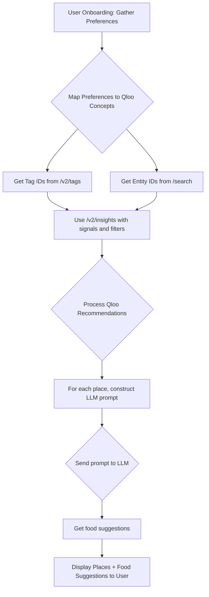

# Qloo API Implementation Plan

This document outlines the plan for building a recommendation engine using the Qloo API and an LLM for specific food suggestions.

## 1. User Onboarding and Preference Gathering

The first step is to understand the user's tastes. We will collect the following information:

- **Favorite Cuisines:** A multi-select list of cuisines (e.g., Italian, Mexican, Japanese, etc.).
- **Types of Places:** A multi-select list of place types (e.g., Restaurant, Cafe, Bar, etc.).
- **Price Range:** A selection for price level (e.g., $, $$, $$$, $$$$).
- **Favorite Places (Optional):** A text input for users to list a few of their favorite restaurants.

These preferences will be mapped to Qloo API concepts:

- **Cuisines and Place Types** will be translated into Qloo `tags`. We will use a hardcoded mapping to link user-friendly selections to their corresponding full Qloo tag URNs.
- **Price Range** will be mapped directly to the `filter.price_level.min` and `filter.price_level.max` parameters in the `/v2/insights` endpoint.
- **Favorite Places** will be used to find initial entity IDs using the `/search` endpoint.

### Tag Mapping Strategy

To ensure valid tags are always sent to the Qloo API, we will implement a hardcoded mapping within our application. This mapping will link user-friendly options (e.g., "Italian", "Cafe", "Brunch") to their corresponding full Qloo tag URNs (e.g., `urn:tag:cuisine:italian`, `urn:tag:place_type:cafe`, `urn:tag:dining_options:place:brunch`). This strategy avoids `400 Bad Request` errors caused by using simple strings as tags.

## 2. Qloo API Interaction Flow

The interaction with the Qloo API will follow a two-step process:

### Step 2.1: Finding Initial Signals

Before we can get recommendations, we need to gather initial "signals" based on the user's preferences.

1.  **Look Up Tag URNs:** For each cuisine and place type selected by the user, we will look up the corresponding full Qloo tag URN from our internal, hardcoded map.
    - **Example:** If the user selects "Italian", the application will retrieve `urn:tag:cuisine:italian` from the map.
    - We will store these retrieved tag URNs.

2.  **Get Entity IDs (Optional):** If the user provided favorite places, we will use the `/search` endpoint to find their Qloo entity IDs.
    - **Endpoint:** `GET /search`
    - **Parameters:** `q={restaurant_name}`, `types=place`
    - **Example:** `GET /search?q=The%20French%20Laundry&types=place`
    - We will store the returned entity IDs.

### Step 2.2: Getting Recommendations

With the signal IDs, we can now query the `/v2/insights` endpoint to get personalized recommendations.

- **Endpoint:** `GET /v2/insights`
- **Parameters:**
  - `filter.type=urn:entity:place` (Required to get place recommendations)
  - `signal.interests.tags={tag_ids}` (Comma-separated list of tag IDs from Step 2.1)
  - `signal.interests.entities={entity_ids}` (Comma-separated list of entity IDs from Step 2.1)
  - `filter.location.query={latitude},{longitude}` (User's current location)
  - `filter.location.radius=8050` (Approximately 5 miles)
  - `filter.price_level.min={min_price}` and `filter.price_level.max={max_price}` (Based on user's preference)
  - `take=10` (To get the top 10 recommendations)
  - `operator.filter.tags=intersection` (To ensure all specified tags are present)

## 3. LLM Integration for Food Suggestions

The Qloo API recommends places, not specific dishes. We will use a Large Language Model (LLM) to bridge this gap.

1.  **Process Qloo Recommendations:** We will iterate through the list of recommended places returned by the Qloo API.

2.  **Construct LLM Prompt:** For each place, we will construct a detailed prompt for an LLM (e.g., Gemini, DeepSeek). The prompt will include:
    - The name of the restaurant.
    - The primary cuisine type (derived from the user's initial preference).
    - Any descriptive tags or summary information available in the Qloo API response.

3.  **Example Prompt:**

    ```
    You are a food recommendation assistant. Based on the following information about a restaurant, please suggest 3 to 5 specific and popular dishes that a user should try.

    Restaurant Name: {restaurant_name}
    Cuisine: {cuisine_type}
    Description: {qloo_summary_or_tags}

    What are the must-try dishes at this restaurant?
    ```

4.  **Get Food Suggestions:** We will send this prompt to the LLM and parse the response to extract the food suggestions for each recommended place.

## 4. Presenting Results to the User

The final step is to display the combined recommendations to the user in a clear and engaging way.

- **UI Layout:** We will present the results as a list of cards. Each card will represent a recommended restaurant.
- **Card Content:** Each card will contain:
  - Restaurant Name
  - Address and distance from the user
  - Qloo's rating and price level
  - The list of specific food suggestions generated by the LLM.
- **Map View:** An interactive map will be displayed alongside the list, showing the locations of all recommended restaurants.

## Mermaid Diagram: Application Flow


